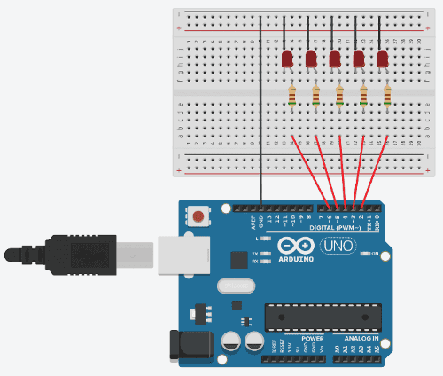
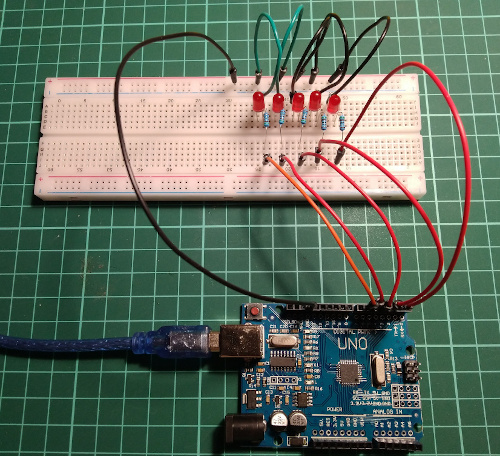
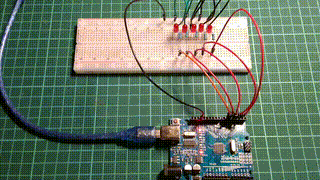

# Running wave of 5 LEDs

Проект на Arduino, созданный на "коленке", демонстрирует работу с светодиодами. Он представляет собой эффект "волны", при котором светодиоды последовательно включаются и перемещаются влево и вправо.

## Материалы

| Component | Quantity   | Note    |
|-----------|:----------:|:-------:|
|Arduino Uno|1           |         |
|Red LED    |5           |         |
|Resistor   |5           |510 Ω    |
|Breadboard |1           |         |
|Jumpers    |11          |         |

## Прототипирование

## Сборка

## Демонстрация

